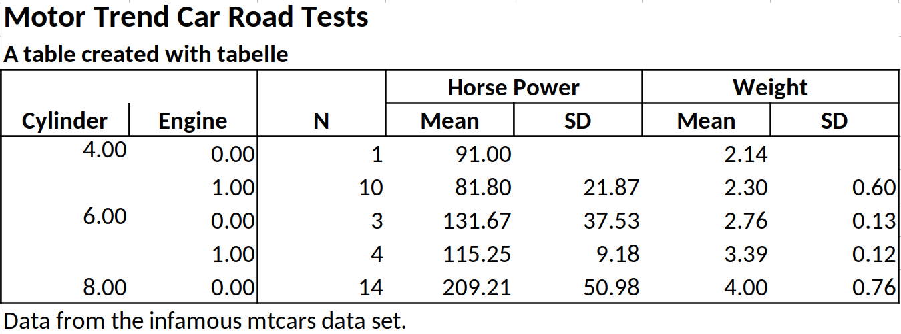

<!-- README.md is generated from README.Rmd. Please edit that file -->

# basicTables

> Create mediocre Excel tables in R.

As implied by the name, the objective of `basicTables` is to provide a
simple to use, but “good enough” approach to creating tables in R. The
main use case is to quickly share tables with a colleague or fried using
the xlsx format.

Due to the limited approach, basicTables is a lot less sophisticated
than the awesome packages gt (great tables, by which the name is
inspired) or expss. That said, as shown below, there are still some
adjustments that users can make to adapt basicTables to their needs.

## Example

The main use case for basicTables is when you already have a summarized
table that you now want to share using xlsx. basicTables will not
summarize data for you or do any sophisticated processing with the data.
It mostly adds column names with spanners, combines rownames, and writes
the result to excel.

Let’s assume we already have a perfectly summarized table from dplyr:

``` r
library(dplyr)

summarized_table <- mtcars |>
  group_by(cyl, vs) |>
  summarise(N = n(),
            mean_hp = mean(hp),
            sd_hp = sd(hp),
            mean_wt = mean(wt),
            sd_wt = sd(wt))
```

Now, we want to create a table, where we show the grouping variables as
row names and also create spanners for the horse power (hp) and the
weight (wt) variables. The result should look something like this:

    |                   | Horse Power |   Weight  |
    | Cylinder | Engine | Mean  |  SD | Mean | SD |
    | -------- | ------ | ----- | --- | ---- | -- |
    |                   |                         |

The table headers are defined with a basic formula approach. For
example, `cyl ~ mean_hp + sd_hp` defines a table with cyl as the row
names and mean_hp and sd_hp as columns. The output in Excel will be
similar to the following:

    |cyl | mean_hp | sd_hp|
    |:---|---------------:|
    |4   | 91          NA |
    |4   | 81.8      21.9 |

Note that the row names (cyl) are in a separate block to the left.

You can add spanner labels with as follows:
`cyl ~ (Horsepower = mean_hp + sd_hp)`

This will result in an Excel output similar to:

    |    |    Horsepower  |
    |cyl | mean_hp | sd_hp|
    |:---|---------------:|
    |4   | 91          NA |
    |4   | 81.8      21.9 |

You can also nest spanners (e.g.,
`cyl ~ (Horsepower = (Mean = mean_hp) + (SD  = sd_hp))`.

In the example above, there is some redundant information: For example,
if we have the spanner label “Horsepower”, we don’t need the “mean\_”
part of “mean_hp”. To remove this redundancy, you can rename the item in
the header using `new_name:old_name`. For example,
`cyl ~ (Horsepower = Mean:mean_hp + SD:sd_hp)` defines a table similar
to the following:

    |    |    Horsepower  |
    |cyl | Mean   | SD    |
    |:---|---------------:|
    |4   | 91          NA |
    |4   | 81.8      21.9 |

Finally, to create a table without row names, use
`1 ~ (Horsepower = Mean:mean_hp + SD:sd_hp)` This defines as table
similar to the following:

    |    Horsepower  |
    | Mean   | SD    |
    |---------------:|
    | 91          NA |
    | 81.8      21.9 |

With this syntax, we can create the initial table as follows:

``` r
tbl <- bt(data = summarized_table,
          formula = Cylinder:cyl + Engine:vs ~
            N +
            (`Horse Power` = Mean:mean_hp + SD:sd_hp) +
            (`Weight` = Mean:mean_wt + SD:sd_wt),
          title = "Motor Trend Car Road Tests",
          subtitle = "A table created with basicTables",
          footnote = "Data from the infamous mtcars data set.")

wb <- write_bt(tbl = tbl)

# Save the excel table:
# openxlsx::saveWorkbook(wb,
#                        file = "cars.xlsx", overwrite = TRUE)
```

The result looks as follows:


